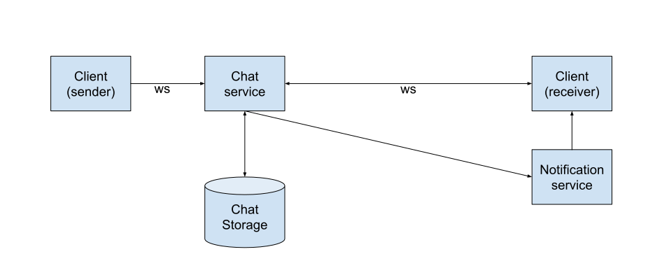
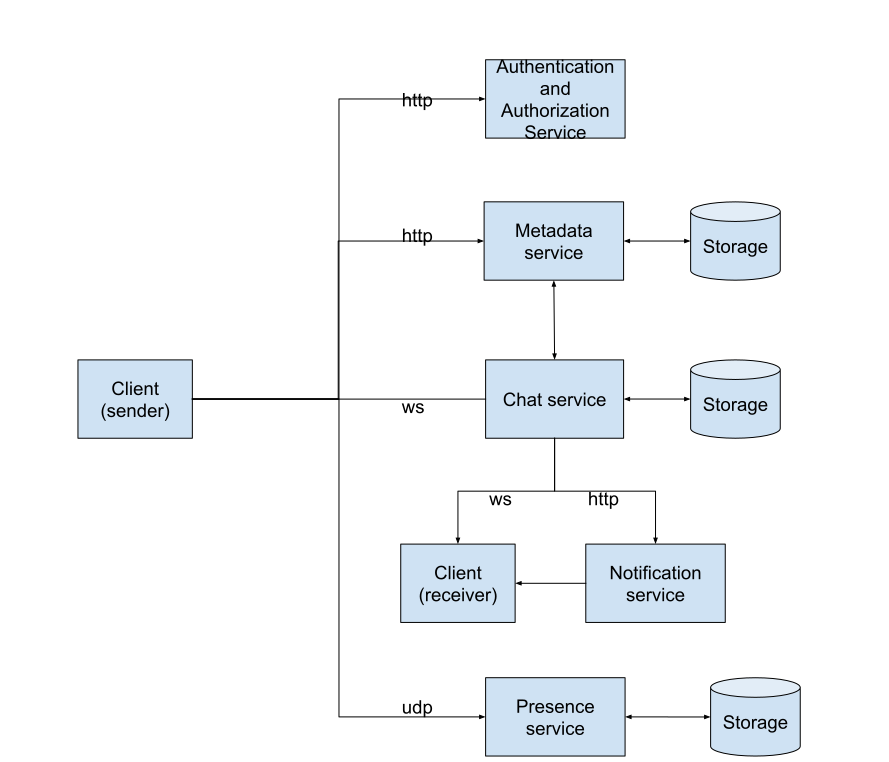

# Chat messaging system

A ‘Chat messaging system’ is something like Whatsapp which enables users to communicate. The communication can be via text messages, photos, videos, audio calls or video calls. Focus here is on communication via text messages

## Requirements
### Functional
- Support 1:1 text messaging
- Support group messaging
- Chat history support
- Chat sync across multiple devices
- Offline indicator for users

### Non-Functional
- Support one billion users
- Usual suspects 
  - Scalable 
  - Available 
  - Durable

## High level design

### Crux : Chat service

* Use a web-service(chat service) between two clients(sender and receiver) which will route the messages
* Use websockets for communication between client and chat service
  * Use of HTTP has two disadvantages
    * Opening of a connection(which is costly) for every message
    * Server needs to initiate a connection when sending a message to the recipient. HTTP is typically used by a client to initiate a single request-response style communication with the client
  * Web sockets allow for bidirectional communication between client and server once a connection has been established
  * Another alternative is client-polling, which is again not efficient
* The chat messages will be stored in a database so that they can be delivered later to an offline client. The storage of chat is limited to that last 30 days off messages. This ensures a limit to the unbounded growth of storage
* Support for chat history will be the responsibility of the client itself. This can be done by using local storage on the client(like SQLite on mobile clients)
* Sync across various clients
  * Maintaining message offset(or timestamp) for each client along with the text messages
  * When a client connects to the chat service all messages after that point are pushed along the websocket connection

### Supporting services

#### Authentication and Authorization service
* This can be a third party service like Okta
* Client connects to this to authenticate and to get requisite authorizations before presenting the same for connection with a chat server

#### Metadata service
* Manages user, group and chat metadata
* The functionality required here demands a simple request-response pattern. HTTP will suffice.
* There will be communication between the chat service and the metadata service for the purposes of identifying the appropriate receiver/channel for a particular chat

#### Notification service
* Send notification to client on new message
* This can also be a third party service

#### Presence service
* Maintains information about online/offline status of clients
* Used by clients to indicate status of contacts
* Queried by chat service to determine if message needs to be sent along the websocket connection
* This information can be maintained by the client sending keep-alive packets to the presence servers periodically
* This can be done using UDP which is lightweight than HTTP which is based over TCP
  * No connection establishment and teardown
  * The delivery is not guaranteed which is fine as a lost message will be compensated by the next keep-alive message

## Operational Scale
### Storage
#### Chat service
* 1 billion users. Assume 1000 messages per day per user and average size of 100 bytes
* 1 billion * 1000 * 100 = 100 terabytes of data per day
  * Monthly storage = 100 terabytes * 30 = 3 petabytes
  * Messages older than a month can be deleted as they are stored in the client. A client which is offline for a month does not get these messages delivered

#### Metadata service
##### User metadata
* user-id, chat-id, username
* 36 + 36 + 50 = 122 bytes per user
* Total storage = 122 * 1 billion users = 122 GB

##### Group metadata
* group id, chat id and group name
* 50 + 36 + 36 = 122 bytes per group
* Assume total groups to be 50 million
* Total storage = 122 * 50 million = 6 GB

##### Chat-user mapping metadata
* Assume the average number of recent chats per user will be 100.
  * The total number of chats can be greater than this. But our storage caters only to the chats in the last 30 days
* Info to be stored is chat-id and user-id
* Total storage = (36 + 36) * 100 * 1 billion = 7.2 TB

#### Presence service
* Need to store timestamp along with user id
* 36 + 4 = 40 bytes per user
* Total storage = 40 * 1 billion = 40 GB

### Concurrent connections
#### Chat service
* 1 billion users per day and 1000 messages per user => 10^12 messages per day
* => 11 million RPS

#### Metadata service
* Metadata requests(CRUD) can be assumed to be uniform and low when compared to the chat service
* Plan for a few million a day just in case. Say 10 million
* => 116 RPS

#### Presence service
* The keep-alive messages should typically be sent every few seconds
* The rationale for this is that a user wishing to send a message might want to check this. This should be as real time as possible. Let this be 10 seconds
* Total number of requests per 10 seconds will be a billion
* => 100 million UDP requests per second

## Detailed design
### Chat service
#### Workload considerations
* Read workload will be light as most read requests are going to be satisfied by the client using local storage once message delivery is done. Only read requests are going to be by out-of sync clients.
  * Access pattern : Given a chat and a message offset/timestamp list the subsequent messages after that
* Write workload is going to be very high. One write per every message transmitted.(11 million RPS)
  * Need a storage solution with fast writes. Cassandra is suitable for this.
    * Leaderless writes means multiple nodes in the cluster can accept writes
    * With LSM based storage engine writes are going to be appended to a commit log initially. Writes to memtable and the storage happen asynchronously
* Storage also needs to support efficient delete of older chat messages(older than 30 days)
  * Time series modeling of chat data with usage of TTL’s means older message deletion will be automatically handled by Cassandra efficiently.

#### Chat contents table
| attribute          | datatype                                        |
|--------------------|-------------------------------------------------|
| chat_id            | uuid(primary key)                               |
| month              | int(primary key)                                |
| creation_timestamp | timestamp(clustering key with TTL of a 30 days) |
| sender             | uuid                                            |
| contents           | text                                            |

* Include the month as a part of the primary key so that chat contents of a particular chat id can be deleted easily by just dropping that partition/row. ???
* Using timestamp as a clustering key helps in automatic dropping of this partition
* This avoids manual deletes by inserting tombstones which can be costly for the cluster
* Writes are fast. In a particular chat, a new chat message for a month results in insertion of a column with timestamp as the column name and the chat message as the value which is fast
* But restoration of chats for a month can happen by reading a single partition/row which is also very fast. The row itself is not too big as it contains chat messages for a month of a particular chat. Cassandra limits the number of columns in a row to two billion. This is more than sufficient

#### Client offset table
|                          |                               |
|--------------------------|-------------------------------|
| chat_id                  | uuid(primary key)             |
| client_id                | uuid(clustering key)          |
| latest_message_timestamp | Timestamp with TTL of 30 days |

* Chat_id being primary key caters to the access pattern which is based on chat_id
* Clustering key of client_id implies ordering. But importantly means that offset information for each client in a chat is stored in a column of the row/partition
* TTL for the offset means that clients who haven’t reported from the past 30 days have their offsets deleted. This ensures no unbounded growth of stored offsets

#### Asynchronous chat message processing
Once a chat message is received by the chat service the following needs to be done
* Write it to storage
* Send it to recipients/clients
* Push notification to clients

Some observations
* Incoming volume of chat messages is high. Doing the above three tasks synchronously would be increase the latency and load on the chat service
  * The processing can be offset to asynchronous tasks by offloading the incoming chat messages to a queue(Kafka)
* Determining recipients for an incoming message would involve a lookup into the metadata storage for every message.
  * The metadata storage would not be able to scale to the incoming volume(11 million RPS).
  * A cache could be placed in front of the metadata storage for this purpose.
    * This could work as the rate of change of chat metadata is low compared to the incoming volume.
  * While this could work, an elegant solution is to decouple storage from the vagaries of a use-case specific access pattern and volume.
  * To this end use a streaming framework like Kafka streams or Flink.
    * The changes to metadata could be connected to the streaming application via a CDC connector(Debezium) so that a use case specific local cache is maintained and in sync
    * Applying a streaming join to an incoming chat message(partitioned by chat id) and the in-sync metadata cache(also partitioned by chat id) would give the intended recipients
  * Once the recipients are generated, the streaming application can forward the message per recipient to the chat server which pushes them out on the respective open websocket connections 

#### Handling scale
* This mind-boggling RPS(11 million) required can be achieved only by deploying multiple instances of the chat server.
  * However clients should not have to maintain web-socket connections with all these instances.
    * Having to do so would quickly drain the battery of the clients
    * Having multiple instances of the chat service maintain connection with each client is inefficient from the chat service point of view too
  * So each client should maintain connection with exactly one instance of the chat service.
  * Whenever a client logs in, the load balancer assigns it a particular instance of a chat service and stores this mapping
  * The client establishes a websocket connection with this instance of the chat server
  * Any subsequent message send is done via this connection
  * Message delivery
    * The streaming app determines the recipient/s for a particular message and forwards the same to a load balancer
    * The load balancer looks up its mapping table to find out the particular instance of the chat server assigned to the recipient and forwards the message
  * Storage : Cassandra is build to handle scale
    * Read replica support
    * Dataset partitioned over nodes
    * Leaderless writes
      * Last-write-wins : Since a particular chat message is written to by only one client this will not factor in any correctness issues

### Metadata service
* Reads and writes for chat metadata data will relatively low(116 RPS)
* Access patterns : Given a user get all chats
* Can be stored in a relational store like PostgresQL
* Single leader(low writes) with read replication configured(for resilience more than read performance)

#### User table
|         |                       |
|---------|-----------------------|
| user_id | uuid(primary key)     |
| chat_id | uuid(secondary index) |
| name    | String                |

* Changes to this table propagate via CDC
* This enables identification of recipients of a particular chat via the streaming application
#### Group table
|          |                   |
|----------|-------------------|
| group_id | uuid(primary key) |
| chat_id  | uuid              |
| name     | string            |

#### Handling scale
* Multiple app instances can be deployed to ensure resilience. This is the basic expectation done via some orchestration platform
* This will imply usage of reverse proxy cum load balancer
* Database leader based replication(for resilience)

## References
* https://bytebytego.com/courses/system-design-interview/design-a-chat-system
* https://www.youtube.com/watch?v=-3Ge8EooS3g
* https://www.cometchat.com/blog/whatsapps-architecture-and-system-design
* https://netflixtechblog.com/scaling-time-series-data-storage-part-i-ec2b6d44ba39
* https://docs.datastax.com/en/tutorials/Time_Series.pdf
* https://www.baeldung.com/cassandra-column-family-data-model
* https://www.toptal.com/big-data/consistent-hashing

## Adjacent reading
* https://netflixtechblog.com/scaling-time-series-data-storage-part-i-ec2b6d44ba39
* https://www.cloudflare.com/en-in/learning/performance/types-of-load-balancing-algorithms/

## To do
* Code something using websockets
* Code something using a authn/authz system like okta
* Impact of large group size?
* API design
* Understand zookeeper and how to implement consistent hashing using zookeeper. Actually why is this needed?
  * How are load balancers implemented?
* Possible thundering herd when a client reconnects to a chat server
* Understand complete architecture of cassandra Apache CassandraArchitecture | Apache Cassandra Documentation​ to understand resilience offered
* Understanding how auth saas work Auth0Authentication and Authorization Flows particulary what exactly does auth saas return once auth is done? A token? Does this encode some authorization info too? Do and see?
* Sync of clients
* Why can’t websockets be used in communication between kafka clients and brokers?
