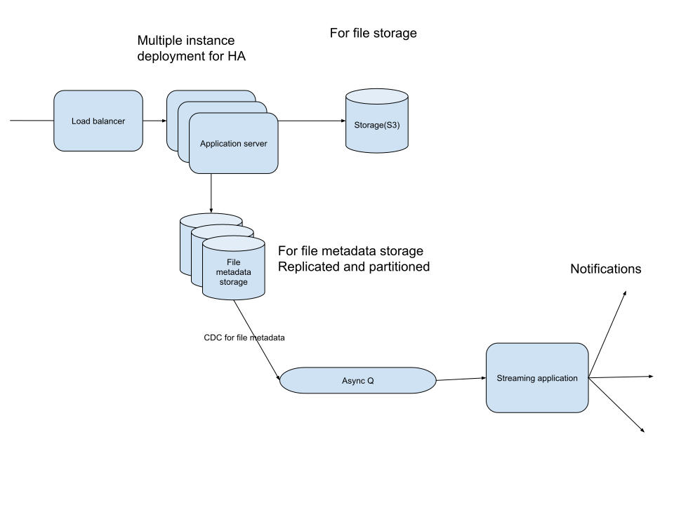

# Cloud storage service
Cloud storage services offer storage, retrieval and sharing of files/documents to end users. Examples in the real-world are DropBox, Google Drive, Box.

## Functional requirements
1. Store and retrieve files remotely
2. Upload files
3. Download files
4. Support sharing of files to multiple users
5. Shared to different users
6. Sync files across multiple clients
7. Access files versions
8. Notifications on actions for shared resources 
9. 

## Non-Functional requirement
1. Scale horizontally
2. Optimize nw bandwidth usage
3. HA

## Sizing
* 1 billion users
* Max of 10000 files per user
* Max size of docs ~ 1 MB per file

## Crux
Actual user data(files) will have to be stored on either a distributed file system or an object store. Either of these storage mediums will have to be horizontally scalable, highly available and resilient to failures.

An object store will be a more appealing abstraction. For example it is desirable to store files as chunks so that modification will be more efficient(Retrieve the chunk corresponding to the location of the file where the edit is done. Reflect the editing there and store it back. This is compared to retrieving the whole file, editing it and storing it back.)

Other metadata like user and file metadata can be stored in databases.

The chunks themselves will need to be tracked

Notifications about actions on shared resources can be generated using event processing async patterns.

Syncing files across multiple clients is unknown as of now.

An application server hosts api’s to provide the functionality required using the above components/systems.

## Interface

|                      | URL                                 | Body                      | Response                                |
|----------------------|-------------------------------------|---------------------------|-----------------------------------------|
| Create a file        | POST /gd/v1/files/                  | File metadata             | file_id                                 |
| Upload file contents | POST /gd/v1/files/{file_id}         | File contents             | -                                       |
| Get a file           | GET /gd/v1/files/{file_id}          | -                         | File metadata with url to download file |
| Download a file      | GET /gd/v1/files/download/{file_id} | -                         | File contents as byte                   |
| Share a file         | PUT /gd/v1/files                    | User and permissions data | -                                       |

## Storage
### Queries
* Given a user, fetch files and the privileges the user has to it
* Given a file, fetch users who have access and their privileges

### Metadata db
#### Data schema
file record : 4 + 4 + 4 = 12 bytes per record

|             |           |            |         |
|-------------|-----------|------------|---------|
| file_id(pk) | createdAt | modifiedAt | s3_link |

shared_with record : 4 + 4 + 20 + 1 = 29 bytes per record

|        |         |      |                  |
|--------|---------|------|------------------|
| id(pk) | file_id | user | mode/permissions |

Composite key : file_is + user

The above schemas should form the bedrock for providing functionality
1. Creating and retrieving files
2. Sharing files

The query patterns mainly will be
1. Retrieve all files(owned and shared with) for a particular user.
2. Given a file, determine the users who have access to it.
Having indexes over file(owner), shared_with(user), shared_with(file_id) should ensure adequate preparation for quick execution of the queries.

#### Considerations

* Rate of changes
  * Unlikely that file metadata information will be changed very often
  * Read workload heavier than write workload
* Total storage requirements
  * 1 billion * 10000 * 12 for file table
  * 1 billion * 11000 * 29 for shared_with table assuming that each user will on an average have access to 1000 other files that he does not own
  * Total storage requirements = (12 * 10^13) + (29 * 11 * 10^12) = 120 terabytes + 319 terabytes ~ 450 terabytes
* Partitioning opportunities
  * Use Cases are going to be driven by the user and hence data can be partitioned by user
  * Shared_with data lends itself to this
  * Owner information can be added file data so that file data can also be partitioned by user
  * An query by file will have user context and will thus help locate the partition containing the required data
* Concurrency
  * There is a causal dependency in adding and removing permissions/users.
  * This might be a critical requirement. Consider the following scenario. Owner removes permission for a user w.r.t. a file and later on adds the same. If this causal dependency is not maintained the user could end up not having access

#### DB choice
A relational database with an appropriate serialization level should take care of the causal dependency. Will any other type of database satisfy this requirement?

The HA requirement can be satisfied by having replication configured. A single leader replication should do to service the higher read workload.

A leaderless or multi-leader

Can be partitioned by ‘user’ to cater to scalability as writes increase. Need number to justify partitioning and replication

