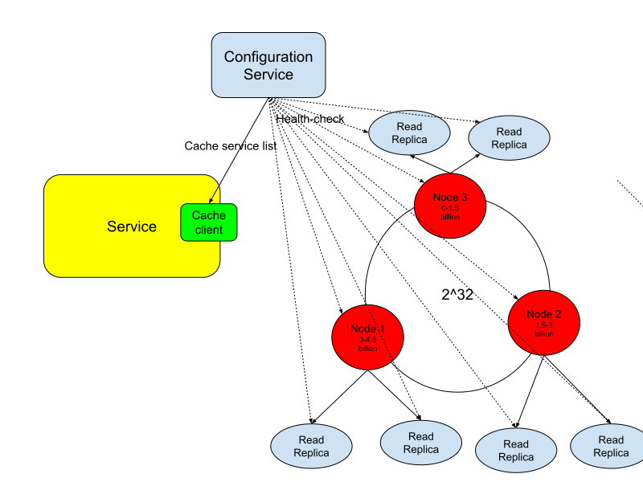

# Distributed Cache

## Requirements
### Functional
* get(key)
* put(key, value)
* delete(key)
* TTL

### Non-Functional
* Scalable : With increase in data
* HA : Individual node failures should be tolerated
* Low latency operations
* Performant : Support high read/write rates

## Fitment - TODO

## The Crux
* Store data in memory to support low latency operations
* Data structure: Hash table
* Keys are hashes of the input keys?? Why?? To prevent hotspots
* Individual nodes are replicated to address the high read rate and HA requirements. Single leader replication
* Data is partitioned(by key) to help with high write rates. Each node hosts a partition
* Cache eviction
  * LRU
  * MRU
  * TTL - Deamon process which purges expired keys
* Use consistent hashing so that introduction of new nodes does not demand moving data in all nodes
  * Jump consistent hashing
* Cache service discovery
  * Criteria
    * Must maintain list of cache servers
    * Servers which go down should be removed from the list
  * Alternatives
    * One gateway node which directs requests to the appropriate node
      * Extra hop
      * Bottleneck for performance and availability
  * All nodes have all the book-keeping information. Any updated information is exchanged between all of them(gossip??). Clients can make a call to any node. Request is forwarded to appropriate node
    * TODO : Why all the extra forwarding??
    * Also, clients anyway have to have the list of servers to randomly select one
  * Use a distributed configuration service(zookeeper) or to maintain a list of servers.
    * Clients will get the list from this service
    * Using the hash of the key and they will determine server on which to operate

## Architecture Diagram

## Real world
* Redis - https://redis.com/redis-enterprise/technology/redis-enterprise-cluster-architecture/
* Memcached

## References
* https://youtu.be/crPoHnhkjFE?feature=shared
* https://youtu.be/ULgXBImWVWQ?feature=shared
* https://youtu.be/4wEQ9_tkqvE?feature=shared
* https://www.youtube.com/watch?v=iuqZvajTOyA

## To do
* Jump consistent caching
* Configuration service zookeeper
* Communication protocols : gossip etc
* https://redis.io/docs/management/scaling/
* https://redis.io/docs/management/replication/
