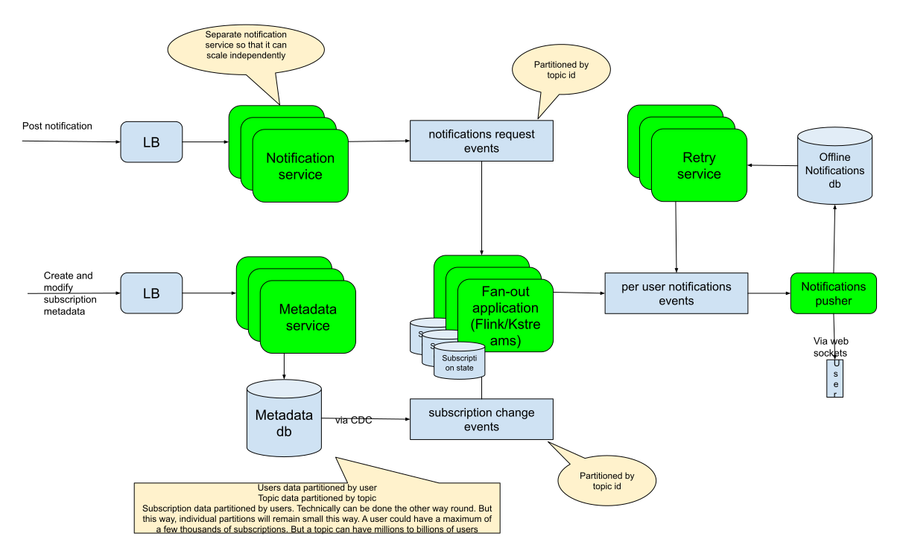

# Notification service

A notification service sends notification to devices
* Notifications to mobiles

## Functional Requirements
* Send notifications to
  * Individual devices 
  * Users(All devices of a user)
  * Groups of users
  * Users/devices subscribed to a particular topic
* Notifications can be fetched later on if the devices/users are offline
* Create topics. This is not done by the end user but by the provider of an app
* Subscribe to topics. Users can subscribe to topics to which they will receive notifications. This typically translates to users subscribing to certain class of notifications within apps
*  What about email and text? Most of the requirements seem to be about app notifications

## Non-Functional Requirements
* Notifications need to be delivered with minimal latency
* Notifications must be delivered only once

## Capacity estimates
There are 8 billion people in the world. Not all of them have access to devices. But a significant few have more than 1 device. So let us go with 8 billion devices. Provision for twice that which is 16 billion.
Assume each notification is 100 bytes and that a device on average receives 10’s of notifications a day. Say 100..

So storage for messages = 100 * 50 * 16 billion = 160 * 10^12 = 160 terabytes of data

Note that this storage is going to be temporary. Notification messages can be discarded soon. Within hours to a max of a few days

Storage is needed for metadata, i.e., users, topics, subscriptions. Even with billions of users and topics(trillions of subscriptions) the storage needed for this is going to be a few low terabytes of data. So replication for high read rates and partitioning for scalable writes is in order. Writes are going to be significantly lower than reads
* Creation of topics, users and subscriptions
* Modification of the above
A single leader replication should work

Not all devices are online all the time. Assume 75% of devices are online(12 billion). Also can assume that notifications are uniformly distributed throughout the world per day.

Request per second = 50 per day * .75 * 16 billion = 7 million requests per second

## Architecture

## To Do
* At-least once delivery
* Bloom filter to deduplicate
* Popular notifications and pull model instead of push
* Fan out to pusher via zk assisted hashring

