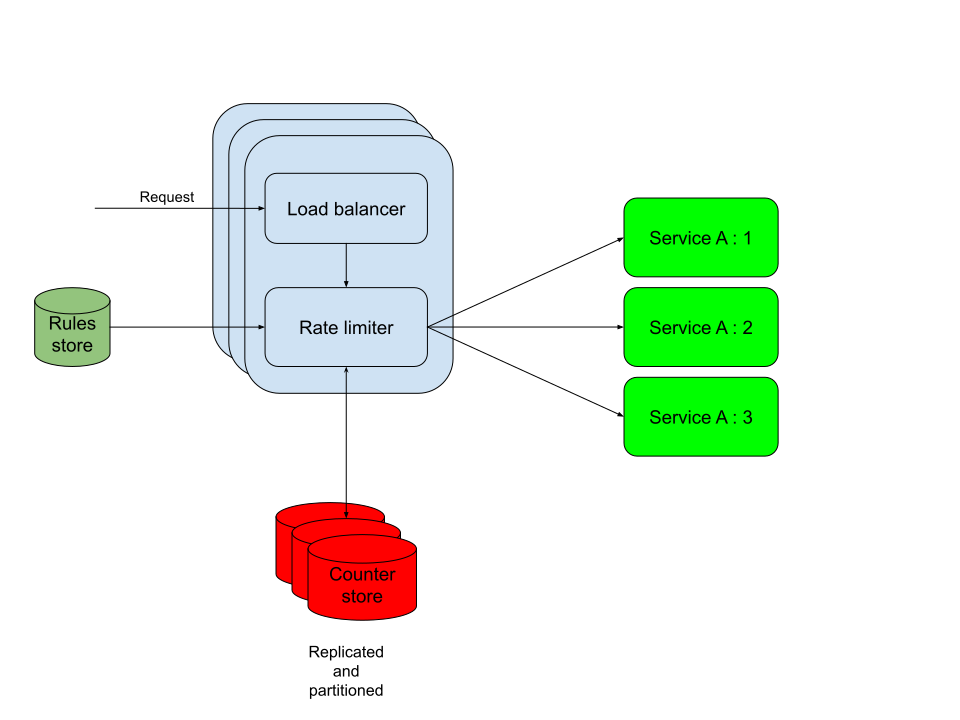

# Rate Limiter

## Functional requirements
* Rate limit based on configuration for a particular service
* Non-functional requirements
* Low latency
* HA

## Sizing
* 1 billion users(Assume a social network)
* 10 requests per minute
  * 10/60 * 1 billion = 167 million requests per second
  * => 167 million read requests per second per user
  * => 167 million write requests per second(counter increments) per user

## Fitment
* Local : Same host
  * Part of the same process: As a part of the service process, i.e. library. Ownership issues, failures in rate-limiter might bring down application
  * Different process : As a separate process but inside the service host. Will be eating away resources from the service.
* As a separate service. Network latency become significant
* As a part of the load-balancer/api-gateway. Preferable

## Crux
* Token bucket/Leaky bucket
  * Older requests can hog the tokens
* [Fixed window](https://github.com/AbhijithMadhav/problem-solving/blob/main/src/main/java/org/am/rate_limiting/FixedWindow.java)
  * Spiky traffic around window boundaries
* [Sliding window with log](https://github.com/AbhijithMadhav/problem-solving/blob/main/src/main/java/org/am/rate_limiting/SlidingWindowLog.java)
  * Computationally costly due to storage of multiple timestamps per clientId and need for iteration through the same
* [Sliding window with counters](https://github.com/AbhijithMadhav/problem-solving/blob/main/src/main/java/org/am/rate_limiting/SlidingWindowCounter.java)
  * Best suited. Low probabilistic chances of inaccuracy
  * Demands concurrency while handling counters

## Data Modeling
### Counter store
* ruleId - 4 bytes -> Part of key
* userId - 16 bytes -> Part of key
* window start timestamp - 8 bytes
* window counter - 4 bytes
* previous window counter - 4 bytes

=> Key-Value store

### Rules store
* ruleId - 4 bytes
* rules in yaml - a few KB

=> Relational database

## Storage
### Counter store
* 1 billion * (4 + 16 + 8 + 4 + 4) = 32 GB per service per rule
  * Could do it just do this in memory if this was a single node rate limiter
  * Since this is a multiple node rate limiter(for HA), an external storage layer for coordination is necessary. Could also do with coordination protocols
    * Gossip
    * Raft
  * Low latency => write through cache makes sense
  * HA & 167 million read requests per second: So storage replication is required
  * Reads/Write: Almost 1:1. Counter increment(write) does not occur for requests which are going to be dropped. Can assume that these rate limited request are going to be few and far in between
    * Since writes are high, the storage needs to be partitioned
    * Since storage is partitioned, a single leader replication should handle the high rate of writes(1.2 million requests). The writes go to different partitions whose leaders can be different nodes
  * Latency
    * Since latency needs to be low, the best option would be to go for in-memory write through cache. But due to the distributed nature(multiple instances for HA) of the rate limiter it would be very complex(coordination protocols like gossip, raft etc) to have cache synchronization.
    * Next best choice would be do go for a distributed cache solution
  * Concurrency
    * Concurrency handling at the application layer is going to be costly as this will involve multiple network operations(for compare and increment counter++).
    * Concurrency handling at the distributed cache layer requires support of atomic primitives by the distributed cache or some kind of native programming support
  * Redis
    * Key-value model
    * Distributed cache
    * Redis Cluster supports single leader replication and partitioning
    * Native Lua script support for our concurrency requirement

### Rules store
A few KB per rule => So 1 MB of storage for 1000 rules. So maximum of a few MB’s
Could store this in a key-value store.
Considering relational store if observability capability needs to be built(no. Of requests, dropped etc)

## Architecture diagram

## Real world implementations
* [Kong](https://docs.konghq.com/gateway/latest/get-started/rate-limiting/) : As a plugin in its API gateway product
* [Google cloud armor](https://cloud.google.com/armor/docs/rate-limiting-overview)
* [HAProxy](https://www.haproxy.com/blog/four-examples-of-haproxy-rate-limiting), https://www.haproxy.com/documentation/haproxy-configuration-tutorials/traffic-policing/

## References
* https://www.youtube.com/watch?v=VzW41m4USGs
* https://www.youtube.com/watch?v=FU4WlwfS3G0
* https://drive.google.com/file/d/10lgud0ZvFueN5jUMU0oNlSvGJiSKZVXd/view?usp=share_link
* https://konghq.com/blog/engineering/api-gateway-vs-load-balancer
* https://konghq.com/blog/engineering/how-to-design-a-scalable-rate-limiting-algorithm
